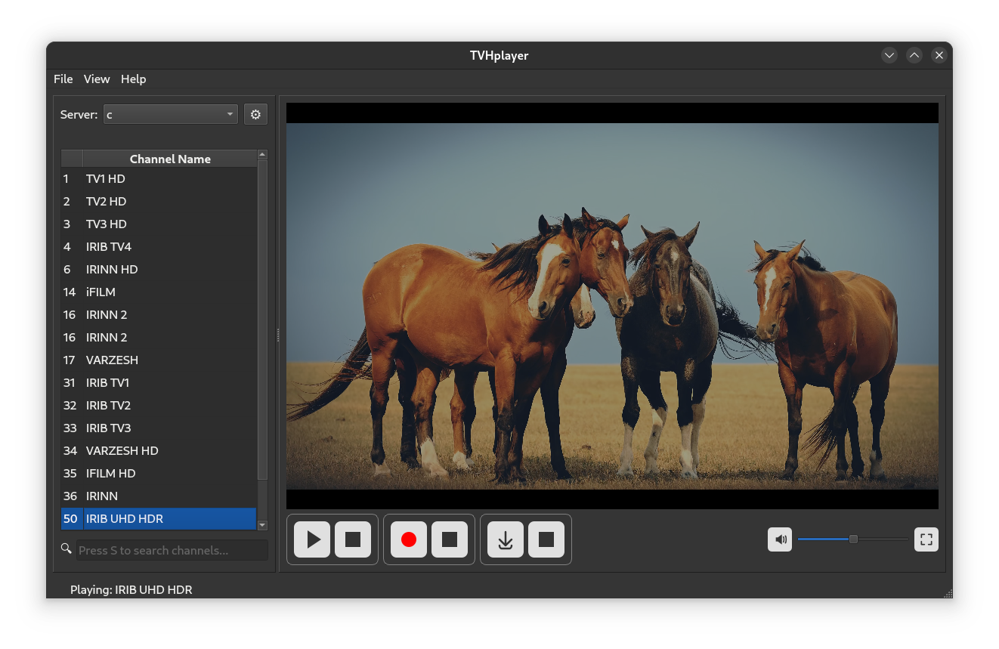

# TVHplayer
A TVheadend client for watching and recording live TV on PC

## Features:

With TVHplayer you can:
- Play live TV & radio channels
- Browse EPG
- Schedule recordings
- Initiate instant recordings with custom duration 
- Record live TV locally on your computer 
- Monitor your server status, signal strength and DVR
- TVHplayer is cross-platform - runs on linux, macOS and Windows

## Download
- Head to [releases](https://github.com/mfat/tvhplayer/releases) section to download the app for your operating system (Linux, MacOS or Windows)
- Linux users can also install the app from [Flathub](https://flathub.org/apps/io.github.mfat.tvhplayer)

## Requirements
- Make sure both digest and plane authentication are enabled in your server
- See requirements.txt for requred python modules
- VLC 
- FFMPEG (used for local recording feature if you need it)
  - On Windows follow [this guide](https://phoenixnap.com/kb/ffmpeg-windows) to add ffmpeg to windows PATH. You can also put ffmpeg.exe in the same directory as tvhplayer.
 
## Help and Support
- Refer to the [User Guide](https://github.com/mfat/tvhplayer/wiki/User-Guide) for more information about using the app. 
- If you encounter any problems [open a bug report](https://github.com/user/repository/issues/new)

## Run the app from source 
- You can run the code directly with python. You may want to do this if you don't want to download an executable.
To do this:
- install python
- download the [requirements.txt](https://github.com/mfat/tvhplayer/blob/main/requirements.txt) and run this command:
  `pip install -r requirements.txt`
- Download the tvhplayer zip file from the latest release and extract to a folder or clone using git:
  `git clone https://github.com/mfat/tvhplayer.git`
- cd into the folder
- Run the app with:
  `python3 tvhplayer/tvhplayer.py`

## Technical information 
- TVHplayer uses Tvheadend's http API (no htsp support yet)
- For playback, it uses libvlc 
  
## Support development
Bitcoin: `bc1qqtsyf0ft85zshsnw25jgsxnqy45rfa867zqk4t`

Doge:  `DRzNb8DycFD65H6oHNLuzyTzY1S5avPHHx`
